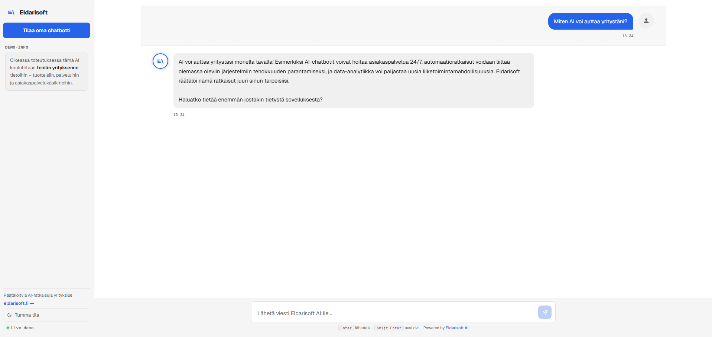
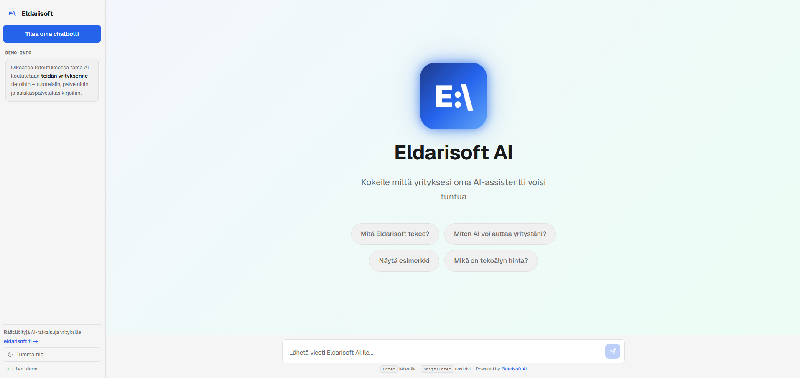

# Eldarisoft AI

> AI chatbot demo for businesses — try it live at [ai.eldarisoft.fi](https://ai.eldarisoft.fi)



## What it does

A production-ready AI chatbot demo that shows businesses what their own AI assistant could look like. Built for [Eldarisoft](https://www.eldarisoft.fi) as both a sales tool and a portfolio piece.

## Live demo

🔗 **[ai.eldarisoft.fi](https://ai.eldarisoft.fi)**



## Tech stack


## Architecture
```
User → ai.eldarisoft.fi (AWS S3 + CloudFront)
     → Cloudflare Worker (rate limiting, hides API key)
     → Anthropic Claude API
```

## Security

- API key stored only in Cloudflare environment variables
- Rate limiting: 100 requests per IP per hour
- Input validation: 500 character limit
- Monthly spending cap: hard limit on Anthropic Console

## About Eldarisoft

Eldarisoft builds custom web applications and AI solutions for businesses in Finland.
→ [www.eldarisoft.fi](https://www.eldarisoft.fi)
